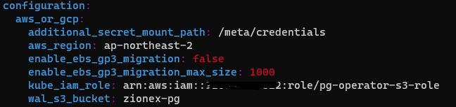

* [Kubernetes Cluster](#kubernetes-cluster)
* [EKS 구성 (AWS Console)](#eks-구성-aws-console)
   * [클러스터 생성](#클러스터-생성)
   * [노드그룹 생성 (<a href="https://docs.aws.amazon.com/ko_kr/eks/latest/userguide/create-managed-node-group.html" rel="nofollow">https://docs.aws.amazon.com/ko_kr/eks/latest/userguide/create-managed-node-group.html</a>)](#노드그룹-생성-httpsdocsawsamazoncomko_krekslatestuserguidecreate-managed-node-grouphtml)
   * [클러스터 접속](#클러스터-접속)
   * [다른 사용자 접근 권한 부여](#다른-사용자-접근-권한-부여)
* [K9S 설치 (Kubernetes CLI To Manage Your Clusters In Style) - Optional](#k9s-설치-kubernetes-cli-to-manage-your-clusters-in-style---optional)
* [AWS ECR](#aws-ecr)
* [Kubernetes deployment (Spring boot App)](#kubernetes-deployment-spring-boot-app)
   * [configMap 설정 (<a href="./configs/configmap.yaml">configs/configmap.yaml</a>)](#configmap-설정-configsconfigmapyaml)
   * [secretKey 설정 (<a href="./configs/secret_config.yaml">configs/secret_config.yaml</a>)](#secretkey-설정-configssecret_configyaml)
* [Auto Scaling 설정](#auto-scaling-설정)
   * [cluster-autoscaler](#cluster-autoscaler)
   * [Horizontal Pod Autoscaling (HPA)](#horizontal-pod-autoscaling-hpa)
* [Monitoring](#monitoring)
   * [Kubernetes Dashboard](#kubernetes-dashboard)
   * [Prometheus &amp; Grafana](#prometheus--grafana)
* [Incident response platform - Pagerduty](#incident-response-platform---pagerduty)
* [Postgres Cluster](#postgres-cluster)
   * [postgres-operator 설치](#postgres-operator-설치)
   * [PG Cluster 생성](#pg-cluster-생성)
   * [Logical Backup (AWS S3)](#logical-backup-aws-s3)


---
# Kubernetes Cluster
|   | 직접 설정         | EKS |
|-------|------------|-------------|
| 구동 환경 | on-premises | AWS        |
| master node | 직접 설치 및 관리 | AWS가 관리        |
| master node HA | 직접 구성  | AWS가 자동으로 구성        |
| 인증 | 직접 구성  | AWS IAM 기반 인증 사용        |
| Pod 네트워크 통신 방식 | 다양한 plugin 지원   | amazon-vpc-cni-k8s 플러그인 : VPC 상에서 유효한 실제 IP를 Pod에 할당      |
| Pod 제한 | 없음   | c5.large에서는 29개의 Pod만 사용 가능. instance 타입에 따라 추가할 수 있는 ENI 수와 ENI 당 IP 수에 제한이 있기 때문에 발생      |

# K8S

# EKS - High-level architecture


# EKS 구성 (AWS Console)
- https://docs.aws.amazon.com/ko_kr/eks/latest/userguide/create-cluster.html
- requirements
  - AWS CLI : https://docs.aws.amazon.com/ko_kr/cli/latest/userguide/getting-started-install.html
  - Kubectl : https://docs.aws.amazon.com/eks/latest/userguide/install-kubectl.html
  - Docker : https://docs.docker.com/engine/install/ubuntu/

## 클러스터 생성
  - Configure cluster
    - Cluster service role
      - Amazon EKS cluster role to allow the Kubernetes control plane to manage AWS resources on your behalf
      - https://docs.aws.amazon.com/ko_kr/eks/latest/userguide/service_IAM_role.html
  - Specify networking
    - VPC
      - 기존 VPC 사용 or 새로운 VPC 생성하여 사용
    - Subnets
      - 기본으로 위에서 선택한 VPC의 모든 Subnets이 선택됨.
      - Amazon EKS는 Kubernetes가 프라이빗 서브넷에 있는 노드에서 실행되는 포드로 트래픽을 로드 밸런싱하는 퍼블릭 서브넷에 퍼블릭 로드 밸런서를 생성할 수 있도록 퍼블릭 및 프라이빗 서브넷이 있는 VPC에서 클러스터를 실행할 것을 권장
      - Amazon EKS는 최소 2개의 가용 영역에 서브넷이 필요하며, 노드와의 제어 플레인 통신을 용이하게 하기 위해 이러한 서브넷에 최대 4개의 네트워크 인터페이스를 생성
    - Security groups
      - Amazon EKS에서는 각 클러스터 제어 영역(클러스터당 하나)에 대한 전용 보안 그룹을 사용할 것을 권장      
    - Cluster endpoint access
      - Public : VPC 외부에서 클러스터, worker node 접근 가능
      - Public and private : VPC 외부에서 클러스터 접근 가능, worker node는 VPC 내부에서만 접근 가능
      - Private : 클러스터, worker node 모두 VPC 내부에서만 접근 가능
    - Networking add-ons (CNI, coreDNS, kube-proxy 모두 사용)
      - Amazon VPC CNI
        - CNI(Container Network Interface) : Pod 간 통신
      - CoreDNS
        - Kubernetes 클러스터 DNS
        - CoreDNS 포드는 클러스터의 모든 포드에 대한 이름 확인을 제공
      - kube-proxy
        - Amazon EC2 노드에서 네트워크 규칙을 관리
        - 포드와의 네트워크 통신을 가능함
  
## 노드그룹 생성 (https://docs.aws.amazon.com/ko_kr/eks/latest/userguide/create-managed-node-group.html)
  - Node Group Role 생성 (아래 3가지 정책을 가지는 IAM Role 생성)
    - https://docs.aws.amazon.com/ko_kr/eks/latest/userguide/create-node-role.html
    - AmazonEKSWorkerNodePolicy
    - AmazonEC2ContainerRegistryReadOnly
    - AmazonEKS_CNI_Policy
  - Cluster -> Configuration -> Compute -> Add node group
  - Configure node group
    - Node IAM role : 위에서 생성한 role 선택
    - Kubernetes taints : 목적에 따라 노드 그룹(cpu / gpu 등) 선택할 수 있도록 key/value 지정 (기본 값은 taint가 존재하지 않고 kubernetes에서 생성한 pod는 모든 노드 사용)
```
node group -> taint 적용 -> deployment.yaml -> tolerations 이용해서 매핑
spec:
  template:
    spec:
      tolerations:
        - key: "GPU"
          operator: "Equal"
          value: "true"
          effect: "NoSchedule"
```

## Service Account 생성
  1. https://docs.aws.amazon.com/ko_kr/eks/latest/userguide/enable-iam-roles-for-service-accounts.html
  2. https://docs.aws.amazon.com/ko_kr/eks/latest/userguide/cni-iam-role.html

## 클러스터 접속
  - kubectl이 설치 되어 있어야 함
  - EKS 구성한 계정으로 AWS CLI 인증 (aws configure) 후 아래 명령어 이용하여 kubeconfig 업데이트
  - `~/.kube/config` 파일에 cluster_name 설정이 추가 되었는지 확인
```
aws eks --region ap-northeast-2 update-kubeconfig --name cluster_name
```
```
kubectl get svc
NAME                  TYPE           CLUSTER-IP      EXTERNAL-IP                                                                    PORT(S)          AGE
backend-service       LoadBalancer   10.100.225.63   aeaf22ec715454210b8414c51e5681d6-1042126422.ap-northeast-2.elb.amazonaws.com   8080:31479/TCP   5d18h
kubernetes            ClusterIP      10.100.0.1      <none>                                                                         443/TCP          5d19h
spring-boot-service   LoadBalancer   10.100.74.133   a2db1b87113cb42d7a0660bde6aa047b-137018002.ap-northeast-2.elb.amazonaws.com    8080:31480/TCP   3d20h
```

## 다른 사용자 접근 권한 부여
  - 기본적으로 EKS를 생성한 계정과 루트 계정만 접속 가능. 
  - 기존에 있던 설정은 건드리지 말고 mapUsers만 새로 추가
  ```
  kubectl edit configmap -n kube-system aws-auth
  ```
  example - aws iam user에 등록된 joonseo 에게 전체 접근 권한(system:masters) 부여
  ```
  data:
    mapRoles: |
      - rolearn: arn:aws:iam::{ACCOUNT_ID}:role/EKSNodeRole
        username: <system:node:{{EC2PrivateDNSName}}>
        groups:
          - system:bootstrappers
          - system:nodes
    mapUsers: |
      - userarn: arn:aws:iam::{ACCOUNT_ID}:user/joonseo
        username: joonseo
        groups:
          - system:masters
  ```

# K9S 설치 (Kubernetes CLI To Manage Your Clusters In Style) - Optional
```
/bin/bash -c "$(curl -fsSL https://raw.githubusercontent.com/Homebrew/install/master/install.sh)"
echo 'eval $(/home/linuxbrew/.linuxbrew/bin/brew shellenv)' >> $HOME/.profile
eval $(/home/linuxbrew/.linuxbrew/bin/brew shellenv)
brew install gcc
brew install derailed/k9s/k9s
```

# AWS ECR
  - container image (여기서는 docker image 사용)를 저장하기 위한 repo 생성
  - https://ap-northeast-2.console.aws.amazon.com/ecr/repositories?region=ap-northeast-2

  - docker 이미지 생성 후 AWS ECR Push
  ```
  cd demo-react
  npm run build
  cd ../demo
  mvn clean package -DskipTests
  
  # AWS ECR repo push commands 참고

  aws ecr get-login-password --region ap-northeast-2 | docker login --username AWS --password -stdin {ACCOUNT_ID}.dkr.ecr.ap-northeast-2.amazonaws.com
  docker build -t demo .
  docker tag demo:latest {ACCOUNT_ID}.dkr.ecr.ap-northeast-2.amazonaws.com/zionex-ecr:demo
  docker push {ACCOUNT_ID}.dkr.ecr.ap-northeast-2.amazonaws.com/zionex-ecr:demo
  ```


# Kubernetes deployment (Spring boot App)
  - [`configs/deployment.yaml`](./configs/deployment.yaml)
## configMap 설정 ([`configs/configmap.yaml`](./configs/configmap.yaml))
  ```
  kubectl apply -f configmap.yaml
  ```
## secretKey 설정 ([`configs/secret_config.yaml`](./configs/secret_config.yaml))
    - secret data의 경우 base64 인코딩 값을 입력 `echo -n 'postgres' | base64`
  ```
  kubectl apply -f secret_config.yaml
  ```

  - spring-boot application.yaml
  ```
  spring:
  datasource:
    url: jdbc:postgresql://${DB_HOST}:5432/testdb
    username: ${DB_USERNAME}
    password: ${DB_PASSWORD}
  ``` 
  - deployment.yaml 작성
    - image : ECR 주소
    - containers[env] : configmap, secretkey 이용
    - replica : pod 개수
  ```
  apiVersion: apps/v1
kind: Deployment
metadata:
  name: spring-boot-demo
  namespace: default
spec:
  replicas: 2
  selector:
    matchLabels:
      app: demo
  template:
    metadata:
      labels:
        app: demo
    spec:
      containers:
      - name: spring-boot
        image: {ACCOUNT_ID}.dkr.ecr.ap-northeast-2.amazonaws.com/zionex-ecr:demo
        imagePullPolicy: "Always"
        ports:
        - containerPort: 8080
        env:
        - name: DB_HOST
          valueFrom:
            configMapKeyRef:
              name: spring-info
              key: db-host
        - name: DB_USERNAME
          valueFrom:
            secretKeyRef:
              name: spring-secret
              key: username
        - name: DB_PASSWORD
          valueFrom:
            secretKeyRef:
              name: spring-secret
              key: password
  ```
```
kubectl apply -f deployment.yaml
kubectl get pods -n default
```

- deployment 재시작
```
kubectl rollout restart deployment spring-boot-demo
```

# pod 내 웹서버 접근하기 위한 service 파일 작성 (`configs/service.yaml`)
- targetPort : pod 포트
- port : 내가 접속할 포트
- type: LoadBalancer (AWS LB 자동 생성)
```
apiVersion: v1
kind: Service
metadata:
  name: spring-boot-service
spec:
  type: NodePort
  selector:
    app: demo
  ports:
    - nodePort: 31480
      port: 8080
      targetPort: 8080
  type: LoadBalancer
```

```
kubectl get svc -n default


# LB 설정이 진행될 동안 대기 후 EXTERNAL-IP:8080 접속 확인

NAME                  TYPE           CLUSTER-IP      EXTERNAL-IP                                                                    PORT(S)          AGE
spring-boot-service   LoadBalancer   10.100.74.133   a2db1b87113cb42d7a0660bde6aa047b-137018002.ap-northeast-2.elb.amazonaws.com    8080:31480/TCP   3d20h
```

# Auto Scaling 설정
## cluster-autoscaler
  - node (instance) 리소스가 부족하면 node (instance) 새로 생성
  - IAM OIDC Provider (https://docs.aws.amazon.com/ko_kr/eks/latest/userguide/enable-iam-roles-for-service-accounts.html)
  - Node group tag를 지정해야 자동 검색됨

 Key         | Value |
|------------|-------------|
| k8s.io/cluster-autoscaler/<my-cluster> | owned        |
| k8s.io/cluster-autoscaler/enabled | TRUE        |
  - https://docs.aws.amazon.com/ko_kr/eks/latest/userguide/autoscaling.html#cluster-autoscaler

1. IAM Policy 생성 (`cluster-autoscaler-policy.json`)
```
{
    "Version": "2012-10-17",
    "Statement": [
        {
            "Action": [
                "autoscaling:DescribeAutoScalingGroups",
                "autoscaling:DescribeAutoScalingInstances",
                "autoscaling:DescribeLaunchConfigurations",
                "autoscaling:DescribeTags",
                "autoscaling:SetDesiredCapacity",
                "autoscaling:TerminateInstanceInAutoScalingGroup",
                "ec2:DescribeLaunchTemplateVersions"
            ],
            "Resource": "*",
            "Effect": "Allow"
        }
    ]
}
```
```
aws iam create-policy \
    --policy-name AmazonEKSClusterAutoscalerPolicy \
    --policy-document file://cluster-autoscaler-policy.json
```
2. IAM Role 생성
  - Trusted entity type : Web identity
  - Identity provider : EKS Cluster
  - Audience : sts.amazonaws.com
  - Filter policies : AmazonEKSClusterAutoscalerPolicy를
  - Role name : AmazonEKSClusterAutoscalerRole
3. Cluster Autoscaler YAML 파일을 다운로드
```
curl -o cluster-autoscaler-autodiscover.yaml https://raw.githubusercontent.com/kubernetes/autoscaler/master/cluster-autoscaler/cloudprovider/aws/examples/cluster-autoscaler-autodiscover.yaml
```
4. <YOUR CLUSTER NAME> 수정 후 클러스터에 적용
```
kubectl apply -f cluster-autoscaler-autodiscover.yaml
```
5. 이전에 생성한 IAM 역할의 ARN을 사용하여 cluster-autoscaler 서비스 계정에 주석을 지정
```
kubectl annotate serviceaccount cluster-autoscaler \
  -n kube-system \
  eks.amazonaws.com/role-arn=arn:aws:iam::<ACCOUNT_ID>:role/<AmazonEKSClusterAutoscalerRole>
```
6. 다음 명령으로 배포를 패치하여 cluster-autoscaler.kubernetes.io/safe-to-evict 주석을 Cluster Autoscaler 포드에 추가
```
kubectl patch deployment cluster-autoscaler \
  -n kube-system \
  -p '{"spec":{"template":{"metadata":{"annotations":{"cluster-autoscaler.kubernetes.io/safe-to-evict": "false"}}}}}'
```
7. 다음 명령을 사용하여 Cluster Autoscaler 배포를 편집
```
kubectl -n kube-system edit deployment.apps/cluster-autoscaler
```
8. cluster-autoscaler 컨테이너 명령을 편집하여 <YOUR CLUSTER NAME>를 클러스터의 이름으로 교체하고 다음 옵션을 추가
  - --balance-similar-node-groups
  - --skip-nodes-with-system-pods=false
```
    spec:
      containers:
      - command:
        - ./cluster-autoscaler
        - --v=4
        - --stderrthreshold=info
        - --cloud-provider=aws
        - --skip-nodes-with-local-storage=false
        - --expander=least-waste
        - --node-group-auto-discovery=asg:tag=k8s.io/cluster-autoscaler/enabled,k8s.io/cluster-autoscaler/<YOUR CLUSTER NAME>
        - --balance-similar-node-groups
        - --skip-nodes-with-system-pods=false
```
9. GitHub에서 Cluster Autoscaler [릴리스(releases)](https://github.com/kubernetes/autoscaler/releases) 페이지를 열고 클러스터의 Kubernetes 메이저 및 마이너 버전과 일치하는 최신 Cluster Autoscaler 버전을 검색. Kubernetes 버전이 1.22이라면 1.22로 시작하는 최신 Cluster Autoscaler 릴리스를 검색 후 이미지 태그 변경
```
kubectl set image deployment cluster-autoscaler \
  -n kube-system \
  cluster-autoscaler=k8s.gcr.io/autoscaling/cluster-autoscaler:v<1.22.n>
```
10. Cluster Autoscaler 로그 보기 
```
kubectl -n kube-system logs -f deployment.apps/cluster-autoscaler
```


## Horizontal Pod Autoscaling (HPA)
  - replica (pod) 개수 조정
  - resource 사용량 확인을 위해 metric server 설치
  ```
  kubectl apply -f https://github.com/kubernetes-sigs/metrics-server/releases/latest/download/components.yaml
  ```
  - autoscale 설정
    - 최소 pods 2개, 최대 pods 3개까지 cpu 사용량 80% 기준으로 증가, 감소
  ```
  kubectl autoscale deployment spring-boot-demo --cpu-percent=80 --min=2 --max=3

  kubectl get hpa -A
NAMESPACE   NAME               REFERENCE                     TARGETS   MINPODS   MAXPODS   REPLICAS   AGE
default     spring-boot-demo   Deployment/spring-boot-demo   0%/80%    2         3         2          2d19h
  ```


# Monitoring

## Kubernetes Dashoboard
- metric server : https://docs.aws.amazon.com/eks/latest/userguide/metrics-server.html
- kubernetes dashboard : https://docs.aws.amazon.com/ko_kr/eks/latest/userguide/dashboard-tutorial.html
```
# metric server 설치 
kubectl apply -f https://github.com/kubernetes-sigs/metrics-server/releases/latest/download/components.yaml
# Verify that the metrics-server deployment is running
kubectl get deployment metrics-server -n kube-system
# kubernetes dashboard
kubectl apply -f https://raw.githubusercontent.com/kubernetes/dashboard/v2.0.5/aio/deploy/recommended.yaml
```

```
kubectl apply -f eks-admin-service-account.yaml
```
### `eks-admin-service-account.yaml`
```
apiVersion: v1
kind: ServiceAccount
metadata:
  name: eks-admin
  namespace: kube-system
---
apiVersion: rbac.authorization.k8s.io/v1
kind: ClusterRoleBinding
metadata:
  name: eks-admin
roleRef:
  apiGroup: rbac.authorization.k8s.io
  kind: ClusterRole
  name: cluster-admin
subjects:
- kind: ServiceAccount
  name: eks-admin
  namespace: kube-system
```

```
# Token 확인
kubectl -n kube-system describe secret $(kubectl -n kube-system get secret | grep eks-admin | awk '{print $1}')

kubectl proxy
# 아래 URL 접속 후 위에서 확인한 Token 정보로 로그인
http://localhost:8001/api/v1/namespaces/kubernetes-dashboard/services/https:kubernetes-dashboard:/proxy/#!/login
```

## Prometheus & Grafana
```
helm repo add prometheus-community https://prometheus-community.github.io/helm-charts

helm upgrade --namespace monitoring --install prometheus prometheus-community/kube-prometheus-stack

# thanos


# Grafana 접속 ID 확인
kubectl get secret --namespace monitoring prometheus-grafana -o jsonpath='{.data.admin-user}' | base64 -d
# Grafana 접속 PW 확인
kubectl get secret --namespace monitoring prometheus-grafana -o jsonpath='{.data.admin-password}' | base64 -d	
# Local에서 접속하기 위해 Portforwarding
kubectl port-forward --namespace monitoring svc/prometheus-grafana 8080:80

# localhost:8080 접속 후 위에서 확인한 ID/PW로 접속
```


# Incident response platform - Pagerduty 
  - Alert rule 추가 ([`configs/prometheus/alert-rules.yaml`](./configs/prometheus/alert-rules.yaml))
```
additionalPrometheusRulesMap:
- name: kubernetes-apps
  groups:
  - name: kubernetes-apps
    rules:
    - alert: InstanceLowMemoryAlert
      expr: :node_memory_MemAvailable_bytes:sum < 50668858390
      for: 1m
      labels:
        severity: critical
      annotations:
        summary: "Instance {{ $labels.host }} a {{ $labels.instance }} test namespace {{ $labels.namespace }} pod {{ $labels.pod }}: memory low"
        description: "{{ $labels.host }} has less than 50G memory available"
    - alert: InstanceDown
      expr: up == 0
      for: 1m
      labels:
        severity: critical
      annotations:
        summary: "Instance [{{ $labels.instance }}] down"
        description: "[{{ $labels.instance }}] of job [{{ $labels.job }}] has been down for more than 1 minute."
```
- pagerduty 연동 (`configs/pagerduty.yaml`)
  - prometheus-integration-key : pageduty -> service -> integrations 에서 확인


```
alertmanager:
  config:
    global:
      resolve_timeout: 1m
      pagerduty_url: https://events.pagerduty.com/v2/enqueue

    route:
      group_by: ['alertname']
      receiver: 'pagerduty-notifications'
      routes:
        - match:
            altername: 'InstanceDown'
          receiver: 'pagerduty-notifications'

    receivers:
    - name: 'pagerduty-notifications'
      pagerduty_configs:
      - service_key: prometheus-integration-key
        send_resolved: true
```

# Postgres Cluster
  - postgres-operator & postgres-operator-ui를 이용
  - https://postgres-operator.readthedocs.io/en/latest/

## postgres-operator 설치
```
# add repo for postgres-operator
helm repo add postgres-operator-charts https://opensource.zalando.com/postgres-operator/charts/postgres-operator

# install the postgres-operator
helm install postgres-operator postgres-operator-charts/postgres-operator --namespace postgres-test --create-namespace

# add repo for postgres-operator-ui
helm repo add postgres-operator-ui-charts https://opensource.zalando.com/postgres-operator/charts/postgres-operator-ui

# install the postgres-operator-ui
helm install postgres-operator-ui postgres-operator-ui-charts/postgres-operator-ui --namespace postgres-test --create-namespace

# Check if Postgres Operator is running
kubectl get pod -l app.kubernetes.io/name=postgres-operator -n postgres-test
kubectl get pod -l app.kubernetes.io/name=postgres-operator-ui -n postgres-test

# Access web interface by port fowarding the UI pod
kubectl port-forward svc/postgres-operator-ui 8081:80 -n postgres-test

```

## PG Cluster 생성
  - postgres-operator-ui 이용
  - postgres-operator-ui와 postgres-operator의 cluster name은 같은 값으로 설정해야 함.
  - 아래 명령어로 설정 확인 및 변경 가능
  ```
  kubectl edit deployment postgres-operator-ui -n postgres-test
  kubectl edit operatorconfiguration postgres-operator -n postgres-test
  ```

  - localhost:8081 접속 후 클러스터 생성

  

  - postgres password 확인
  ```
  kubectl get secret postgres.zionex-pg-cluster.credentials.postgresql.acid.zalan.do -o 'jsonpath={.data.password}' -n postgres-test | base64 -d
  ```

## Logical Backup (AWS S3)
  - S3 접근 권한을 가진 Role 생성 (pg-operator-s3-role)
  ```
  {
    "Version": "2012-10-17",
    "Statement": [
        {
            "Effect": "Allow",
            "Action": [
                "s3:*",
                "s3-object-lambda:*"
            ],
            "Resource": "*"
        }
    ]
}
  ```

  - S3 Bucket 생성 (zionex-pg)
  - postgres-operator 설정 변경
    - aws_or_gcp 항목에 aws-region, kube_iam_role, wal_s3_bucket 추가
    - logical_backup_schedule 항목에서 cron 형식으로 백업 주기 설정
  


