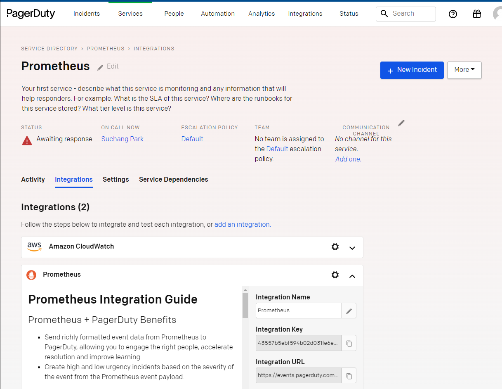

# Kubernetes Cluster
|   | 직접 설정         | EKS |
|-------|------------|-------------|
| 구동 환경 | on-premises | AWS        |
| master node | 직접 설치 및 관리 | AWS가 관리        |
| master node HA | 직접 구성  | AWS가 자동으로 구성        |
| 인증 | 직접 구성  | AWS IAM 기반 인증 사용        |
| Pod 네트워크 통신 방식 | 다양한 plugin 지원   | amazon-vpc-cni-k8s 플러그인 : VPC 상에서 유효한 실제 IP를 Pod에 할당      |
| Pod 제한 | 없음   | c5.large에서는 29개의 Pod만 사용 가능. instance 타입에 따라 추가할 수 있는 ENI 수와 ENI 당 IP 수에 제한이 있기 때문에 발생      |

# EKS 구성 (AWS Console)
- https://docs.aws.amazon.com/ko_kr/eks/latest/userguide/create-cluster.html
- requirements
  - AWS CLI : https://docs.aws.amazon.com/ko_kr/cli/latest/userguide/getting-started-install.html
  - Kubectl : https://docs.aws.amazon.com/eks/latest/userguide/install-kubectl.html
  - Docker : https://docs.docker.com/engine/install/ubuntu/

## 클러스터 접속
  - EKS 구성한 계정으로 AWS CLI 인증 (aws configure) 후 아래 명령어 이용

```
kubectl get svc
NAME                  TYPE           CLUSTER-IP      EXTERNAL-IP                                                                    PORT(S)          AGE
backend-service       LoadBalancer   10.100.225.63   aeaf22ec715454210b8414c51e5681d6-1042126422.ap-northeast-2.elb.amazonaws.com   8080:31479/TCP   5d18h
kubernetes            ClusterIP      10.100.0.1      <none>                                                                         443/TCP          5d19h
spring-boot-service   LoadBalancer   10.100.74.133   a2db1b87113cb42d7a0660bde6aa047b-137018002.ap-northeast-2.elb.amazonaws.com    8080:31480/TCP   3d20h
```

## 다른 사용자 접근 권한 부여
- 기본적으로 EKS를 생성한 계정과 루트 계정만 접속 가능. 
- 기존에 있던 설정은 건드리지 말고 mapUsers만 새로 추가
```
kubectl edit configmap -n kube-system aws-auth
```
example - aws iam user에 등록된 joonser 에게 전체 접근 권한(system:masters) 부여
```
data:
  mapRoles: |
    - rolearn: arn:aws:iam::910058517622:role/EKSNodeRole
      username: <system:node:{{EC2PrivateDNSName}}>
      groups:
        - <system:bootstrappers>
        - <system:nodes>
  mapUsers: |
    - userarn: arn:aws:iam::910058517622:user/joonseo
      username: joonseo
      groups:
        - <system:masters>
```

# K9S 설치 (Kubernetes CLI To Manage Your Clusters In Style) - Optinal
```
/bin/bash -c "$(curl -fsSL https://raw.githubusercontent.com/Homebrew/install/master/install.sh)"
echo 'eval $(/home/linuxbrew/.linuxbrew/bin/brew shellenv)' >> $HOME/.profile
eval $(/home/linuxbrew/.linuxbrew/bin/brew shellenv)
brew install gcc
brew install derailed/k9s/k9s
```

# AWS ECR repo 생성 및 push
- container image (여기서는 docker image 사용)를 저장하기 위한 repo 생성
- https://ap-northeast-2.console.aws.amazon.com/ecr/repositories?region=ap-northeast-2

- sample
```
cd ../demo-react
npm run build

cd ../demo
mvn clean install

cd ..
```

- ECR repo name : zionex-ecr (AWS console에 나오는 View push commands 이용)
```
aws ecr get-login-password --region ap-northeast-2 | docker login --username AWS --password -stdin 910058517622.dkr.ecr.ap-northeast-2.amazonaws.com
docker build -t zionex-ecr .
docker tag zionex-ecr:latest 910058517622.dkr.ecr.ap-northeast-2.amazonaws.com/zionex-ecr:latest
docker push 910058517622.dkr.ecr.ap-northeast-2.amazonaws.com/zionex-ecr:latest
```

# Kubernetes deployment (`configs/deployment.yaml` 참고)
  - configMap 설정 (`configs/configmap.yaml`)
  ```
  kubectl apply -f configmap.yaml
  ```
  - secretKey 설정 (`configs/secret_config.yaml`)
  ```
  kubectl apply -f secret_config.yaml
  ```
  - spring-boot application.yaml
  ```
  spring:
  datasource:
    url: jdbc:postgresql://${DB_HOST}:5432/testdb
    username: ${DB_USERNAME}
    password: ${DB_PASSWORD}
  ``` 
  - deployment.yaml 작성
    - image : ECR 주소
    - containers[env] : configmap, secretkey 이용
    - replica : pod 개수
  ```
  apiVersion: apps/v1
kind: Deployment
metadata:
  name: spring-boot-demo
  namespace: default
spec:
  replicas: 2
  selector:
    matchLabels:
      app: demo
  template:
    metadata:
      labels:
        app: demo
    spec:
      containers:
      - name: spring-boot
        image: 910058517622.dkr.ecr.ap-northeast-2.amazonaws.com/zionex-ecr:demo
        imagePullPolicy: "Always"
        ports:
        - containerPort: 8080
        env:
        - name: DB_HOST
          valueFrom:
            configMapKeyRef:
              name: spring-info
              key: db-host
        - name: DB_USERNAME
          valueFrom:
            secretKeyRef:
              name: spring-secret
              key: username
        - name: DB_PASSWORD
          valueFrom:
            secretKeyRef:
              name: spring-secret
              key: password
  ```
```
kubectl apply -f deployment.yaml
kubectl get pods -n default
```

# pod 내 웹서버 접근하기 위한 service 파일 작성 (`configs/service.yaml`)
- targetPort : pod 포트
- port : 내가 접속할 포트
- type: LoadBalancer (AWS LB 자동 생성)
```
apiVersion: v1
kind: Service
metadata:
  name: spring-boot-service
spec:
  type: NodePort
  selector:
    app: demo
  ports:
    - nodePort: 31480
      port: 8082
      targetPort: 8080
  type: LoadBalancer
```

```
kubectl get svc -n default


#LB 설정이 진행될 동안 대기 후 EXTERNAL-IP:8082 접속 확인

NAME                  TYPE           CLUSTER-IP      EXTERNAL-IP                                                                    PORT(S)          AGE
spring-boot-service   LoadBalancer   10.100.74.133   a2db1b87113cb42d7a0660bde6aa047b-137018002.ap-northeast-2.elb.amazonaws.com    8080:31480/TCP   3d20h
```

# Auto Scaling 설정
## cluster-autoscaler
  - https://docs.aws.amazon.com/ko_kr/eks/latest/userguide/autoscaling.html#cluster-autoscaler
  - node (instance) 리소스가 부족하면 node (instance) 새로 생성

## Horizontal Pod Autoscaling (HPA)
  - replica (pod) 개수 조정
  - resource 사용량 확인을 위해 metric server 설치
  ```
  kubectl apply -f https://github.com/kubernetes-sigs/metrics-server/releases/latest/download/components.yaml
  ```
  - autoscale 설정
    - 최소 pods 2개, 최대 pods 3개까지 cpu 사용량 80% 기준으로 증가, 감소
  ```
  kubectl autoscale deployment spring-boot-demo --cpu-percent=80 --min=2 --max=3

  kubectl get hpa -A
NAMESPACE   NAME               REFERENCE                     TARGETS   MINPODS   MAXPODS   REPLICAS   AGE
default     spring-boot-demo   Deployment/spring-boot-demo   0%/80%    2         3         2          2d19h
  ```


# Monitoring (Prometheus, Grafana)

## Prometheus & Grafana
```
helm repo add prometheus-community https://prometheus-community.github.io/helm-charts

helm upgrade --namespace prometheus --install kube-stack-prometheus prometheus-community/kube-prometheus-stack

# Grafana 접속 ID 확인
kubectl get secret --namespace prometheus kube-stack-prometheus-grafana -o jsonpath='{.data.admin-user}' | base64 -d
# Grafana 접속 PW 확인
kubectl get secret --namespace prometheus kube-stack-prometheus-grafana -o jsonpath='{.data.admin-password}' | base64 -d	
# Local에서 접속하기 위해 Portforwarding
kubectl port-forward --namespace prometheus svc/kube-stack-prometheus-grafana 8080:80

# localhost:8080 접속 후 위에서 확인한 ID/PW로 접속
```


# Pagerduty - https://zionex.pagerduty.com/

- Alert rule 추가 (`configs/alert-rules.yaml`)
```
additionalPrometheusRulesMap:
- name: kubernetes-apps
  groups:
  - name: kubernetes-apps
    rules:
    - alert: InstanceLowMemoryAlert
      expr: :node_memory_MemAvailable_bytes:sum < 50668858390
      for: 1m
      labels:
        severity: critical
      annotations:
        summary: "Instance {{ $labels.host }} a {{ $labels.instance }} test namespace {{ $labels.namespace }} pod {{ $labels.pod }}: memory low"
        description: "{{ $labels.host }} has less than 50G memory available"
    - alert: InstanceDown
      expr: up == 0
      for: 1m
      labels:
        severity: critical
      annotations:
        summary: "Instance [{{ $labels.instance }}] down"
        description: "[{{ $labels.instance }}] of job [{{ $labels.job }}] has been down for more than 1 minute."
```
- pagerduty 연동 (`configs/pagerduty.yaml`)
  - prometheus-integration-key : pageduty -> service -> integrations 에서 확인


```
alertmanager:
  config:
    global:
      resolve_timeout: 1m
      pagerduty_url: https://events.pagerduty.com/v2/enqueue

    route:
      group_by: ['alertname']
      receiver: 'pagerduty-notifications'
      routes:
        - match:
            altername: 'InstanceDown'
          receiver: 'pagerduty-notifications'

    receivers:
    - name: 'pagerduty-notifications'
      pagerduty_configs:
      - service_key: prometheus-integration-key
        send_resolved: true
```


